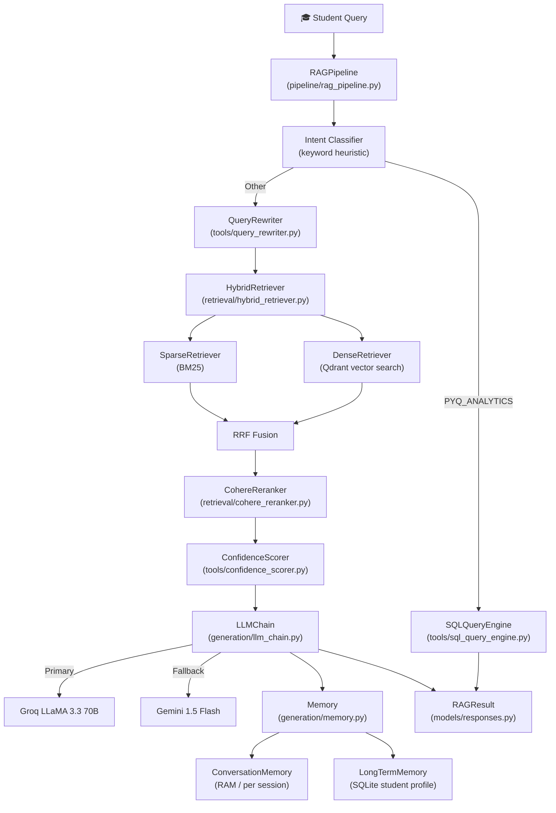

# 🧠 SyllAIq — Deep Module Breakdown

> **SyllAIq** is an AI-powered exam preparation RAG system for **RGPV CSE students** (V1 scope: Operating Systems).  
> It answers questions in English + Hinglish using textbooks, PYQs, and syllabus data.

---

## 🏗️ Architecture Overview



---

## 📦 Module-by-Module Deep Dive

---

### 1. `pipeline/rag_pipeline.py` — **The Brain** 🎯
**The most important file. Orchestrates every step.**

| Step | What happens |
|------|-------------|
| 1 | Save user turn to **short-term memory** |
| 2 | **Intent classification** (keyword heuristics) |
| 2b | If `PYQ_ANALYTICS` → **direct SQL routing** (skip RAG) |
| 3 | **Query rewriting** with conversation context |
| 4 | **Hybrid retrieval** (Dense + BM25 + RRF fusion) |
| 5 | **Reranking** (Cohere API) |
| 6 | **Confidence scoring** |
| 7 | Extract top-N docs |
| 8 | **LLM generation** with short+long-term memory context |
| 9 | Update both memory layers, mark weak areas |

**Key design decision**: Analytical queries (e.g. "how many questions from Unit 3?") are **short-circuited to SQL** — they never go through the vector RAG pipeline. This is efficient and accurate.

---

### 2. `config/settings.py` — **The Single Truth** ⚙️
**All configuration lives here. No magic numbers anywhere else.**

Key config categories:
- **Project Identity**: `PROJECT_NAME="SyllAIq"`, `TARGET_UNIVERSITY="RGPV"`, `TARGET_BRANCH="CSE"`
- **Paths**: `DATA_DIR`, `VECTORSTORE_PATH`, `BM25_INDEX_PATH`, `CHUNKS_JSON`
- **RGPV OS Syllabus**: Unit 1-5 definitions + topic lists (hardcoded knowledge)
- **Qdrant Collections**: `os_textbook`, `os_pyqs`, `os_syllabus`
- **Embedding**: `BAAI/bge-small-en-v1.5` (384-dim)
- **Retrieval params**: `DENSE_TOP_K=20`, `BM25_TOP_K=20`, `RRF_K=60`, `RERANK_TOP_N=5`
- **LLMs**: Primary=Groq `llama-3.3-70b-versatile`, Fallback=Gemini `gemini-1.5-flash`
- **Confidence gates**: HIGH=0.85, MEDIUM=0.60
- **Security**: Rate limits, injection pattern blacklist, off-topic keyword list

> [!IMPORTANT]
> `RGPV_OS_UNIT_TOPICS` (units 1-5 with dozens of topic keywords) is used by the metadata tagger to auto-assign units to document chunks during ingestion.

---

### 3. `retrieval/` — **Finding the Right Chunks** 🔍

#### `hybrid_retriever.py` — Combines both worlds
- Calls `DenseRetriever` (Qdrant cosine similarity) AND `SparseRetriever` (BM25)
- Merges results using **Reciprocal Rank Fusion (RRF)**:
  ```
  score(doc) = Σ [ 1 / (k + rank_in_list) ]   for each list the doc appears in
  ```
  `k=60` (default) — dampens top-rank dominance

#### `dense_retriever.py` — Vector search via Qdrant
- Embeds query using `HFEmbedder` (BAAI/bge-small-en-v1.5)
- Routes to correct Qdrant collection based on **intent**:
  - `PYQ_RETRIEVAL` → `os_pyqs`
  - `SYLLABUS_LOOKUP` → `os_syllabus`
  - else → `os_textbook`
- Supports **unit filter** (metadata filter on Qdrant)

#### `sparse_retriever.py` — BM25 keyword search
- Loads pre-built BM25 index from `bm25_index.pkl`
- Classical TF-IDF-based search on tokenized corpus

#### `cohere_reranker.py` — Precision reranking
- Takes fused candidates → calls **Cohere Rerank API**
- Returns `(Document, score)` pairs, sorted by relevance
- Final output: top `RERANK_TOP_N=5` documents

#### `nli_grader.py` — Relevance grading
- Uses NLI model to score groundedness of answer vs. context
- Thresholds: `NLI_RELEVANCE_THRESHOLD=0.4`, `NLI_GROUNDEDNESS_THRESHOLD=0.6`

---

### 4. `generation/` — **Producing the Answer** ✍️

#### `llm_chain.py` — Dual-LLM with fallback
```
Primary: Groq (LLaMA 3.3 70B) → Fallback: Gemini 1.5 Flash → Error message
```
- Injects: system prompt + personalization hint + conversation history + retrieved context + user query
- Returns `RAGResult` with answer, citations, timing, token count

#### `memory.py` — Two-tier memory 🧠
| Layer | Type | Storage | Scope | Purpose |
|-------|------|---------|-------|---------|
| **Short-term** (`ConversationMemory`) | In-RAM `deque` | Cleared on restart | Per session | Last N turns for multi-turn chat |
| **Long-term** (`LongTermMemory`) | SQLite | Persisted to disk | Cross-session | Student profile, weak areas, topic frequency |

**SQLite schema (3 tables)**:
- `student_queries` — every query logged
- `topic_frequency` — how often each topic asked per student
- `weak_areas` — topics with repeated low-confidence answers

**Personalization**: Before each generation, `get_personalization_hint()` builds a string like:
> _"Student has asked 12 questions so far. Weak areas needing extra clarity: Deadlock, Semaphores. Recently studied: Unit 4."_
This is injected into the system prompt!

#### `prompt_templates.py`
- `SYSTEM_PROMPT` — core persona and rules
- `build_context_block()` — formats retrieved docs as numbered context
- `build_prompt()` — assembles the full user prompt from query + context + intent

---

### 5. `ingestion/` — **Loading Raw Data** 📥

#### `pdf_loader.py` — Multi-engine PDF loader
**3-engine fallback chain**: PyMuPDF (fitz) → pdfplumber → pypdf
- Loads PDFs page-by-page → `Document` objects
- Loads PYQ JSON datasets (structured exam questions)
- Loads syllabus (JSON or plain text with regex splitting)

#### `metadata_tagger.py` — Auto-tagging
- Maps text content to syllabus unit and topic using `RGPV_OS_UNIT_TOPICS` from config
- Detects chapter numbers from heading patterns

#### `data_cleaner.py`
- Cleans OCR artifacts, normalizes whitespace, strips headers/footers

---

### 6. `chunking/` — **Splitting Documents** ✂️

| File | Strategy | Use case |
|------|----------|----------|
| `recursive_chunker.py` | Recursive character text splitter | General textbook content (800 chars, 150 overlap) |
| `pyq_chunker.py` | One chunk per question | PYQ questions (already atomic) |
| `syllabus_chunker.py` | One chunk per unit | Syllabus units |

---

### 7. `tools/` — **Specialized Capabilities** 🔧

#### `query_rewriter.py`
- Uses LLM to rewrite ambiguous queries into clearer, self-contained questions
- Takes conversation context from `ConversationMemory` to resolve references like "tell me more about it"

#### `confidence_scorer.py`
- Scores retrieved document set using reranker scores
- Returns `ConfidenceLevel.HIGH/MEDIUM/LOW` + float score
- Triggers weak area tracking when LOW

#### `sql_query_engine.py` — Text-to-SQL for analytics
- **LLM-generated SQL**: Uses Groq to convert "how many questions from Unit 3 in 2022?" → SQL
- **Safety validator**: Blocks INSERT/UPDATE/DELETE/DROP etc.
- **Heuristic fallback**: Rule-based SQL when LLM unavailable
- Outputs formatted Markdown table + executed SQL

---

### 8. `vectorstore/qdrant_store.py` — **Vector Storage** 🗄️

- Wraps Qdrant client (local or cloud via `QDRANT_URL`)
- Manages 3 collections: `os_textbook`, `os_pyqs`, `os_syllabus`
- Methods: `upsert_documents()`, `search()`, `delete_collection()`
- Stores `Document` fields as Qdrant payload for metadata filtering

---

### 9. `embedding/hf_embedder.py` — **Vectorization** 🔢

- Uses `sentence-transformers` with `BAAI/bge-small-en-v1.5`
- 384-dimensional dense vectors
- Batch encoding with configurable batch size

---

### 10. `database/pyq_db.py` — **PYQ SQL Database** 🗃️

- SQLite database (`data/syllaiq.db`)
- Table: `pyqs` — stores all previous year questions
- Used **exclusively** by `SQLQueryEngine` for analytics queries
- Methods: `insert_pyq()`, `execute_read_query()`, `get_schema_description()`

---

### 11. `models/` — **Data Contracts** 📋

#### `documents.py`
```python
SourceType: TEXTBOOK | PYQ | SYLLABUS | WEB
ConfidenceLevel: HIGH | MEDIUM | LOW
Intent: CONCEPT_EXPLANATION | PYQ_RETRIEVAL | PYQ_ANALYTICS | TOPIC_IMPORTANCE | SYLLABUS_LOOKUP | UNKNOWN
Document  # Main chunk DTO with all metadata + retrieval scores
Citation  # User-facing source reference
```

#### `responses.py`
```python
RAGResult  # Final pipeline output: answer + citations + confidence + timing
```

---

## 🔄 Complete Request Flow (Normal Query)

```
Student: "Explain Banker's Algorithm"
  │
  ▼
RAGPipeline.ask()
  ├─ [1] memory.add_user_turn(session_id, query)
  ├─ [2] intent = CONCEPT_EXPLANATION (no analytics keywords)
  ├─ [3] rewriter.rewrite("Explain Banker's Algorithm", context=last_2_turns)
  │       → "Explain Banker's Algorithm for deadlock avoidance in Operating Systems"
  ├─ [4] retriever.retrieve(rewritten_query, intent=CONCEPT_EXPLANATION)
  │       ├─ dense: top-20 from os_textbook (Qdrant cosine)
  │       ├─ sparse: top-20 from BM25 index
  │       └─ RRF fusion → top-15 candidates
  ├─ [5] reranker.rerank(top-15 → top-5)
  ├─ [6] confidence_scorer.score(top-5) → HIGH, 0.91
  ├─ [7] top_docs = top-5 documents
  ├─ [8] llm_chain.generate(
  │       query, top_docs, intent, HIGH, 0.91,
  │       history=last_N_messages, personalization="Weak: Deadlock, Semaphores"
  │       ) → calls Groq → answer + citations
  └─ [9] memory.add_assistant_turn(), long_term.log_query()
```

---

## ⚡ Analytics Query Flow (Short-circuit)

```
Student: "How many questions from Unit 4 in 2022?"
  │
  ▼
intent = PYQ_ANALYTICS
  └─ SQLQueryEngine.execute_and_format(query)
       ├─ generate_sql() → "SELECT COUNT(*) FROM pyqs WHERE unit=4 AND year=2022"
       ├─ is_safe_sql() → True
       ├─ db.execute_read_query() → [(7,)]
       └─ format Markdown table → RAGResult (bypasses all RAG!)
```

---

## 🔑 Key Patterns to Know

| Pattern | Where | Why |
|---------|-------|-----|
| **Dependency Injection** | `RAGPipeline.__init__` | All components injectable → easy testing/mocking |
| **Singleton Memory** | `generation/memory.py` | `_short_term`, `_long_term` module-level singletons |
| **Engine Fallback** | `pdf_loader.py`, `llm_chain.py`, `sql_query_engine.py` | Graceful degradation when primary fails |
| **Intent-based routing** | `rag_pipeline.py`, `dense_retriever.py` | Analytics → SQL, others → vector RAG |
| **Metadata filtering** | `dense_retriever.py` | Unit filter passed to Qdrant payload filter |
| **Safety validation** | `sql_query_engine.py`, `config/settings.py` | SQL allowlist + injection pattern blacklist |

---

## 📁 Modules by Priority to Study

```
⭐⭐⭐ MUST UNDERSTAND FIRST
  pipeline/rag_pipeline.py     ← orchestrator, read first
  config/settings.py           ← all config & knowledge
  models/documents.py          ← core DTOs

⭐⭐ UNDERSTAND NEXT
  generation/llm_chain.py      ← LLM integration
  generation/memory.py         ← memory architecture
  retrieval/hybrid_retriever.py ← RRF fusion
  tools/sql_query_engine.py    ← analytics path

⭐ UNDERSTAND LATER
  ingestion/pdf_loader.py      ← data loading
  chunking/recursive_chunker.py← chunking strategy
  vectorstore/qdrant_store.py  ← storage layer
  embedding/hf_embedder.py     ← embedding
  retrieval/cohere_reranker.py ← reranking
  tools/query_rewriter.py      ← query improvement
```
